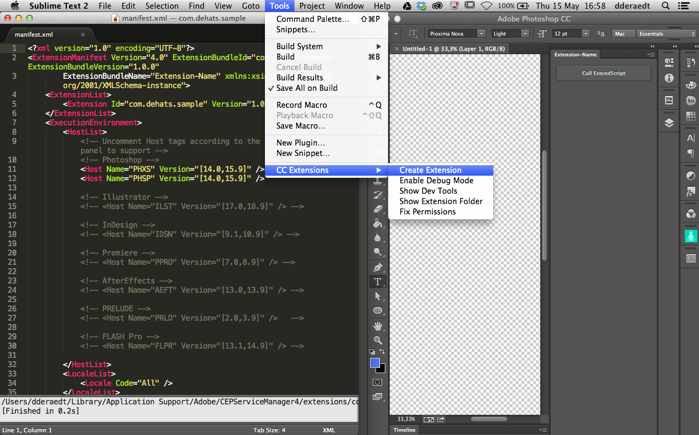

#CC Extension Builder for Sublime Text

This Sublime Text 2 package lets you create HTML/CSS/JS based extension panels for Adobe CC apps such as Photoshop, Illustrator, InDesign, or After Effects. It is meant for the current CEP4.2 architecture (compatible with the current versions of CC apps).

*This is a work in progress. For now, it only supports Mac OSX. Windows users can use [the equavilent extension for Brackets](https://github.com/davidderaedt/CC-Extension-Builder-for-Brackets)*

##Installation

For now, you have to download the ZIP of this repository, unzip it, and then copy the folder to the `Packages` directory (which you can find under `Preferences > Browse Packages`).

You should now find a new `CC Extensions` menu under the `Tools` menu.

Support for *Package control* will come later.

##Usage

If you're new to HTML extension development for CC apps, you must first configure your system to allow custom extension debugging. To do so, choose `Tools > CC Extensions > Enable Debug Mode`. You only have to do this once.

###Creating a new extension

Then, go to `Tools > CC Extensions > Create Extension`. When prompted, choose your extension unique ID, and hit enter. It will generate a pre-deployed extension panel and open the corresponding `manifest.xml` file, which you must edit according to your needs (starting with the "host" list, which determines which CC app this extension applies to, and is set to Photoshop by default).

At this stage, you should be able to open your CC application (say, Photoshop) and choose `Window > extensions > Extension-Name`, which should open a new panel containing a simple button.

###Developing your extension

First, you should select `Project > Add Folder To Project` and choose the created `com.example.extension` folder to get access to your panel's HTML, CSS and javascript files in your sublime project.

To know more about HTML panel development, please refer to the [official documentation](http://wwwimages.adobe.com/content/dam/Adobe/en/devnet/cs-extension-builder/pdfs/CC_Extension_SDK.pdf).

It is a good practice to have your business logic in separated JSX (extendscript) files. To test those files directly, new build systems are added with this package. For example the build system `Photoshop script` will execute the extendScript file directly in Photoshop, without having to reload your panel. Note that only Photoshop, Illustrator and InDesign are supported at this stage.

##Troubleshooting

If nothing seems to happen, chances are you there was a permission issue with the plugin. To fix this, choose `Tools > CC Extensions > Fix Permissions`.

If an extension folder was indeed created, but your CC apps prompts you with an "Unable to load extension" error (or something similar), you should make sure you correctly enabled debug mode on your system.

##About

This plugin was developped on top of the unofficial [Creative Cloud Extension SDK](https://github.com/davidderaedt/CC-EXT-SDK).
